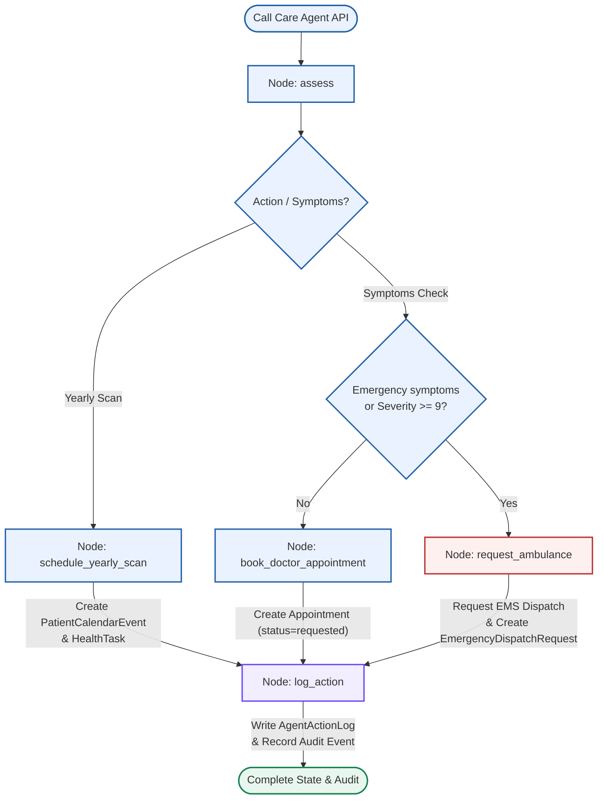

# MedRAG India: System Flow & Architectural Analysis

This document provides a detailed breakdown of how the **MedRAG India** production-rebuild system processes requests. It covers the end-to-end user query flow, LangGraph workflow state transitions, safety mechanisms, hybrid retrieval pipeline, audit trails, and the specific role of the Large Language Model (LLM).

---

## 1. System Overview

MedRAG India is structured into two main applications:
1. **Frontend (`apps/web`)**: A React + TypeScript web application served by Vite in development and Express in production.
2. **Backend (`apps/api`)**: A FastAPI application leveraging LangGraph for state management, SQLAlchemy/Alembic for database operations (PostgreSQL), Qdrant for vector indexing, and local/OpenAI LLM integrations.

Rather than letting the LLM run unconstrained agent loops or call arbitrary APIs directly, the system uses a **bounded, security-first LangGraph architecture**. This is critical for clinical decision safety and regulatory compliance (aligned with HIPAA and India's DPDP Act).

---

## 2. Flowchart: Complete Query Processing Life Cycle

Below is the visual workflow detailing what happens when a query enters the system:

```mermaid
graph TD
    %% Styling
    classDef routeNode fill:#e7f5f3,stroke:#0f766e,stroke-width:2px;
    classDef safetyNode fill:#fff0f0,stroke:#bd3434,stroke-width:2px;
    classDef retrievalNode fill:#eaf2ff,stroke:#2563a9,stroke-width:2px;
    classDef databaseNode fill:#f2edff,stroke:#6d4aff,stroke-width:2px;
    classDef clientNode fill:#e8f6ef,stroke:#168350,stroke-width:2px;
    classDef policyNode fill:#fff4e6,stroke:#b86b16,stroke-width:2px;

    User([User Types Query]) -->|"POST /api/clinical/ask"| API[FastAPI Router]:::clientNode
    
    subgraph Security & Policy Checks
        API --> Auth{Auth & Role?}:::policyNode
        Auth -->|Unauthorized| Err401[401 Unauthorized]
        Auth -->|Authorized| Consent{Compliance check:<br/>Consent & Care Team?}:::policyNode
        Consent -->|No Access| Err403[403 Forbidden]
        
        Consent -->|Has Access| AIPolicy[AiPolicyService]:::policyNode
        AIPolicy -->|"Evaluate Mode & Policy<br/>(Patient vs Doctor)"| Audit[AuditService]:::databaseNode
        Audit -->|"Log 'clinical.ask'<br/>(Audit table)"| Graph[ClinicalRagGraph.invoke]:::routeNode
    end

    subgraph LangGraph State Machine (ClinicalRagGraph)
        Graph --> NodeSafety[safety_check]:::safetyNode
        
        NodeSafety -->|Emergency Terms Match| RouteEscalate[Urgent Escalation]:::safetyNode
        NodeSafety -->|Normal Query| NodeRoute[route_query]:::routeNode
        
        NodeRoute -->|Zero-shot Classifier / Router LLM| RouteDecision{Needs RAG?}:::routeNode
        
        %% Skip Retrieval Path
        RouteDecision -->|No / Skip| NodeGenSkip[generate]:::routeNode
        
        %% Retrieval Path
        RouteDecision -->|Yes| NodeRewrite[rewrite_query]:::routeNode
        NodeRewrite -->|"Generate variations<br/>(QueryRewriteService)"| NodeRetrieve[retrieve]:::retrieverNode
        
        subgraph Hybrid Retrieval Pipeline
            NodeRetrieve --> Dense[Dense Search<br/>Qdrant Vector DB]:::retrievalNode
            NodeRetrieve --> Sparse[Sparse Search<br/>BM25 candidates]:::retrieverNode
            Dense --> RRF[Reciprocal Rank Fusion]:::retrieverNode
            Sparse --> RRF
            RRF --> Rerank[Cross-Encoder Reranker]:::retrieverNode
        end
        
        Rerank --> NodeCompress[compress_evidence]:::retrieverNode
        NodeCompress -->|"Extract top 3 sentences<br/>(EvidenceCompressionService)"| NodeGen[generate]:::routeNode
        
        NodeGenSkip --> NodeVal[validate_citations]:::routeNode
        NodeGen --> NodeVal
        NodeVal -->|"Check inline references<br/>(CitationValidationService)"| NodeFinal[finalize]:::routeNode
    end

    %% Escalation Shortcut
    RouteEscalate --> NodeFinal
    
    subgraph Post-Processing & Tracing
        NodeFinal --> Privacy[PrivacyService]:::policyNode
        Privacy -->|"Redact PHI (Aadhaar, ABHA)<br/>& Apply Minimum Necessary"| Trace[AnswerTraceService]:::databaseNode
        Trace -->|"Record trace details<br/>(AnswerTrace table)"| Respond[Return JSON Answer]:::clientNode
    end

    Respond --> User
```

---

## 3. Step-by-Step Flow Details: Clinical Ask Route (`/clinical/ask`)

Here is exactly what occurs when a patient or doctor queries the medical RAG stack:

### Step 3.1: Gateway and Authentication Check
- **API Entry**: The request hits `POST /api/clinical/ask` defined in [clinical.py](file:///c:/Users/rkaus/OneDrive/Documents/New%20project/apps/api/app/api/routes/clinical.py).
- **Access Control**: FastAPI extracts the user's token via dependencies. The `ComplianceService` checks:
  1. If a doctor is querying, does the doctor have care-team membership and patient consent?
  2. If the patient is querying, they are allowed access to their own data.
- **AI Policy Evaluator**: The `AiPolicyService` inspects the user's role and search terms.
  - If a **Patient** asks questions containing diagnostic/prescriptive keywords (e.g., *"diagnose"*, *"prescribe"*, *"confirm"*), the service returns `allowed=False` with a specific refusal warning.
  - If a **Patient** asks a general question, the mode is set to `patient_education_only` (no diagnostics allowed; plain educational terminology only).
  - If a **Doctor** is the client, the mode is set to `clinician_decision_support` (providing differential considerations, contraindications, and guidelines).
- **Auditing**: The system immediately writes an immutable record to the audit tables via `AuditService`.

### Step 3.2: LangGraph Execution (`ClinicalRagGraph`)
The request payload and policy configuration are sent to the `ClinicalRagGraph` state machine in [clinical_graph.py](file:///c:/Users/rkaus/OneDrive/Documents/New%20project/apps/api/app/graphs/clinical_graph.py). The graph runs through the following nodes:

1. **`safety_check`**: 
   - Uses `ClinicalSafetyService` to classify the input.
   - It checks for red flags like *"chest pain"*, *"difficulty breathing"*, or *"severe bleeding"*.
   - If an emergency is detected, it flags the state as `urgent_escalation` and short-circuits straight to `finalize`.
2. **`route_query`**:
   - Categorizes the query type using `QueryRouterService`.
   - The zero-shot classifier classifies the text into:
     - `no_rag_needed` / `general_health_education`: Skip database retrieval.
     - `clinical_guideline_needed`: Retrieve from the Medical Guidelines collection only.
     - `patient_record_needed`: Retrieve from Patient Records collection only.
     - `both_patient_record_and_guideline`: Retrieve from both collections.
   - If router confidence is below the threshold, it falls back to retrieving from **both** sources.
3. **`rewrite_query`**:
   - If RAG is required, the query rewrite service leverages the LLM to write up to 3 retrieval queries to capture clinical synonyms, lab terminology, and spelling variations.
4. **`retrieve`**:
   - Queries the database collections using the `HybridMedicalRetriever`.
   - Performs a **dense search** (BGE-M3 text embeddings in Qdrant) with metadata visibility filters ensuring patient isolation.
   - Performs a **sparse search** (BM25 Okapi) on exact terms (vital for drug names and lab metrics).
   - Merges results using **Reciprocal Rank Fusion (RRF)**.
   - Reranks candidate chunks with a **Cross-Encoder model** for accuracy.
5. **`compress_evidence`**:
   - Runs `EvidenceCompressionService` to split source texts into sentences, scoring them by word overlap against the user question.
   - Keeps only the top 3 most relevant sentences to fit within context limits.
6. **`generate`**:
   - Prompts the generation LLM (local fine-tuned BioMistral-7B, OpenAI GPT, or stub) with the versioned prompt `clinical-rag-v1`.
   - Injects the role-based policy instruction (educational vs. decision support) and safety disclaimers.
7. **`validate_citations`**:
   - Runs `CitationValidationService` to verify that the generated answer has placed inline citation brackets (e.g., `[source_id]`). If missing, it appends a source list to prevent citation hallucinations.
8. **`finalize`**:
   - Handles safety state overrides. If `urgent_escalation` or `policy_refusal` were triggered earlier, this node discards generated answers and returns predefined safe redirect instructions.

### Step 3.3: Post-Graph Processing & Answer Tracing
- **PHI Redaction**: The `PrivacyService` runs patterns over the answer text, scrubbing common identifiers (Aadhaar, ABHA cards, phone numbers).
- **Answer Tracing**: The system records the complete execution profile via `AnswerTraceService` into the DB. This records the exact prompt version, LLM name, adapter parameters, retrieved context snippets, latency, and user role.
- **Return**: The API responds with the finalized sanitised answer, sources list, and trace metadata.

---

## 4. Step-by-Step Flow Details: Care Coordination Agent (`/care-agent`)

The system handles care tasks (like appointment booking, yearly checks, and ambulance dispatches) via the `CareCoordinationAgent` in [care_agent_graph.py](file:///c:/Users/rkaus/OneDrive/Documents/New%20project/apps/api/app/graphs/care_agent_graph.py).



### Steps in the Care Graph:
1. **`assess`**: 
   - Determines the target action.
   - For symptom entries, checks the severity (1–10 scale) and scans for emergency words via `ClinicalSafetyService`.
   - If symptoms are severe (severity >= 9 or emergency terms match), it routes to `request_ambulance`.
   - Otherwise, it routes to `book_doctor_appointment`.
2. **`schedule_yearly_scan`**: 
   - Inserts a scheduled `PatientCalendarEvent` and a pending preventive `HealthTask` in the database.
3. **`book_doctor_appointment`**: 
   - Creates a pending doctor `Appointment` record with urgency flags set relative to reported symptoms.
4. **`request_ambulance`**: 
   - Connects to `AmbulanceDispatchService` to issue an emergency request, saving an `EmergencyDispatchRequest` record with a provider reference.
5. **`log_action`**: 
   - Commits a record to the `AgentActionLog` detailing the logic step taken, the database parameters used, and writes an audit event.

---

## 5. How the LLM Calls Tools

A crucial architectural aspect of this system is that **the LLM does not perform direct or dynamic tool-calling loops**. 

```
[Traditional LLM Agent Flow]
LLM ---> (Thinks) ---> Calls Tool (API/Write) ---> (Thinks) ---> Returns Answer

[MedRAG India Bounded Flow]
LangGraph State ---> [LLM Node] (Classify / Rewrite / Generate Only)
      |
      +--------------> [Database / Service Node] (Write Appt / Call EMS / Run Qdrant)
```

### Why this design was chosen:
1. **Safety and Predictability**: Clinical systems cannot risk the hallucination of API calls. For example, an LLM deciding when to dispatch an ambulance or how to schedule an appointment is highly dangerous.
2. **Deterministic Routing**: Decisions regarding writing records (saving appointments, dispatching emergency support, scheduling reminders) are handled by **deterministic Python code** in the graph nodes, utilizing rules and explicit parameters.
3. **Role of LLM**: The LLM is confined strictly to text-processing capabilities inside specific nodes:
   - **Query Routing**: Classifies search intent.
   - **Query Rewriting**: Expands medical phrases.
   - **Response Generation**: Summarizes grounded evidence.
4. **Strict Audit Trail**: By separating LLM reasoning from tool execution, every graph node change is logged in Postgres. If an ambulance is requested, the system records it as a concrete state machine transaction, not an opaque text completion history.

---

## 6. Key Subsystems and Mechanics

### 6.1 Hybrid Retrieval Mechanics
The `HybridMedicalRetriever` implements a multi-stage retrieval architecture:
- **Dense Vector Retrieval**: Uses the `BGE-M3` model to output vectors. Filters are applied inside Qdrant based on patient visibility tags (ensuring patient A cannot retrieve documents belonging to patient B).
- **Exact Match Sparse Retrieval**: Runs `BM25Okapi` over retrieved documents. This retains exact keyword matches for specific drug names (e.g., *"Metformin"*) or laboratory metrics (e.g., *"HbA1c"*).
- **Reciprocal Rank Fusion (RRF)**: Merges dense and sparse lists by applying scoring:
  $$S_{RRF}(d) = \sum_{m \in M} \frac{1}{k + r_m(d)}$$
  Where $r_m(d)$ is the rank of document $d$ in system $m$, and $k=60$.
- **Cross-Encoder Reranker**: Passes the candidate chunks and query into a reranker model to compute final matching scores.

### 6.2 Data Security and Privacy Guardrails
- **Download Restricting**: A core API policy blocks clinical staff from executing raw document downloads. Only the patient owning the document can retrieve the binary file.
- **Answer Redaction**: All stored chat interactions (`AnswerTrace`) have names, emails, telephone numbers, and Aadhaar card formats scrubbed before being written to the database.
- **Cache Controls**: All clinical API responses include explicit cache headers preventing intermediate proxies or local browsers from holding local copies of sensitive records:
  ```http
  Cache-Control: no-store, no-cache, must-revalidate
  Pragma: no-cache
  Expires: 0
  ```
